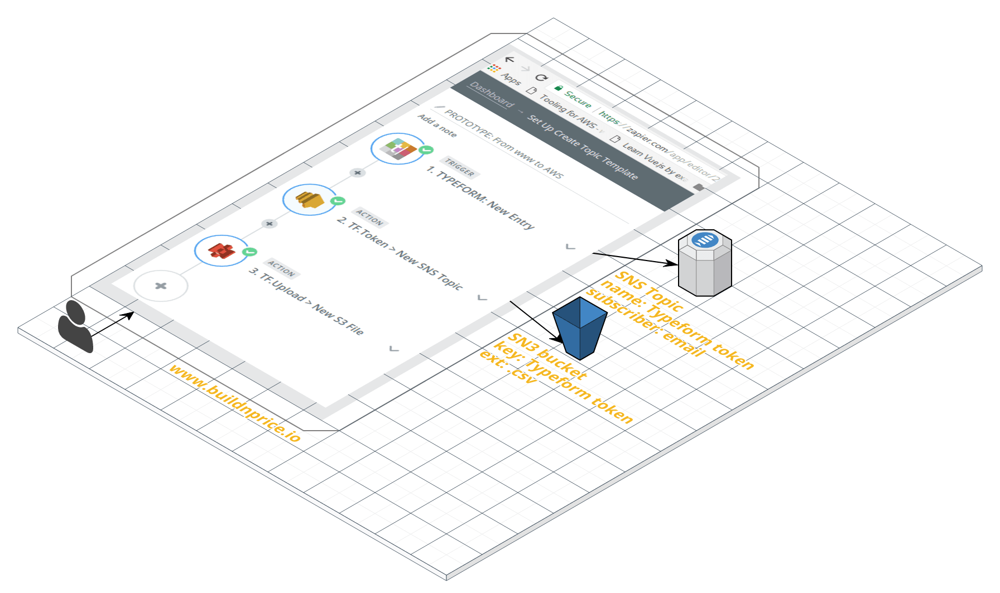
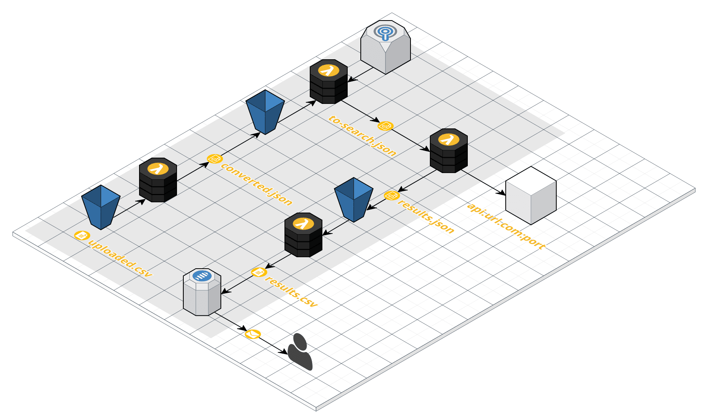

# Protótipo Build and Price
Decidi provar ser possível a cotação automática de produtos via internet no formato marketplace, mesmo que o fornecedor não possua um site de comércio eletrônico.
Notou o destaque na palavra automática? As soluções de e-procurementdisponíveis no mercado são, basicamente, portais onde os fornecedores respondem aos pedidos de cotação dos clientes — neste ponto, nada muito diferente do bom e velho e-mail.
## Fluxo
Ao preencher o formulário do Typeform, o arquivo é replicado à AWS:

## Fluxo Amazon Webservices
A cada arquivo criado no S3 é disparado uma função Labmda que o converte em formato JSON:
